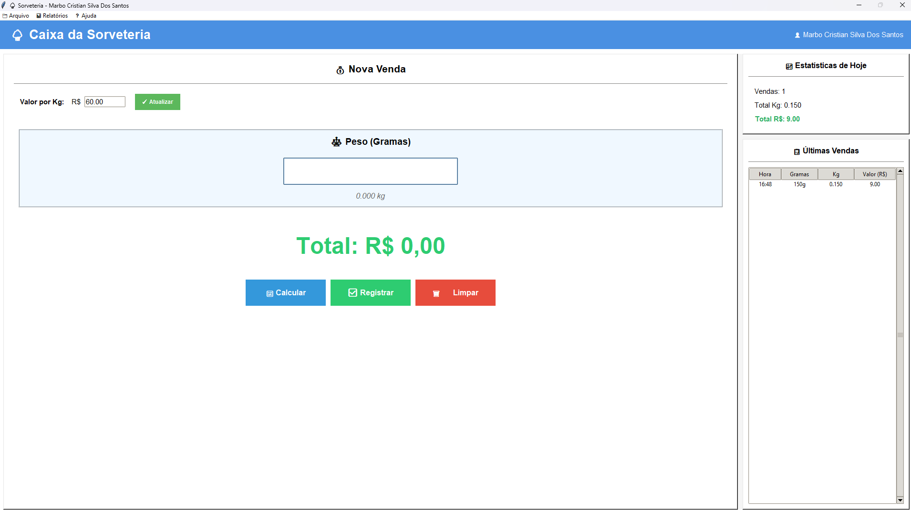

# 🍦 Sistema de Sorveteria

Sistema completo para gestão de vendas de sorveteria por peso, desenvolvido em Python com interface gráfica.


## 📸 Screenshots

_Sistema em execução:_



## 🎯 Funcionalidades

### ✅ Gestão de Usuários
- Cadastro de usuários com senha criptografada (SHA-256)
- Sistema de login seguro
- Recuperação de senha com pergunta de segurança
- Múltiplos usuários simultâneos

### ✅ Vendas
- Entrada de peso em **gramas** com conversão automática para kg
- Cálculo automático do valor total
- Registro de vendas no banco de dados
- Histórico de vendas em tempo real
- Atalhos de teclado para agilidade

### ✅ Relatórios
- Relatório diário
- Relatório mensal
- Relatório anual
- Estatísticas em tempo real
- Exportação de dados detalhados

### ✅ Configurações
- Valor personalizável por kg
- Interface maximizada (tela cheia)
- Tema moderno e responsivo

## 🛠️ Tecnologias Utilizadas

- **Python 3.7+**
- **Tkinter** - Interface gráfica
- **SQLite3** - Banco de dados local
- **Hashlib** - Criptografia de senhas
- **Datetime** - Controle de datas

## 📦 Instalação

### Pré-requisitos

- Python 3.7 ou superior
- Tkinter (geralmente já vem com Python)

### Windows

```bash
# 1. Clone o repositório
git clone https://github.com/marbocristian/sistema-sorveteria.git

# 2. Entre na pasta do projeto
cd sistema-sorveteria

# 3. Execute o sistema
python main.py


Linux/macOS
# 1. Clone o repositório
git clone https://github.com/SEU_USUARIO/sistema-sorveteria.git

# 2. Entre na pasta do projeto
cd sistema-sorveteria

# 3. Instale o tkinter (se necessário)
sudo apt-get install python3-tk  # Ubuntu/Debian
# ou
brew install python-tk  # macOS

# 4. Execute o sistema
python3 main.py